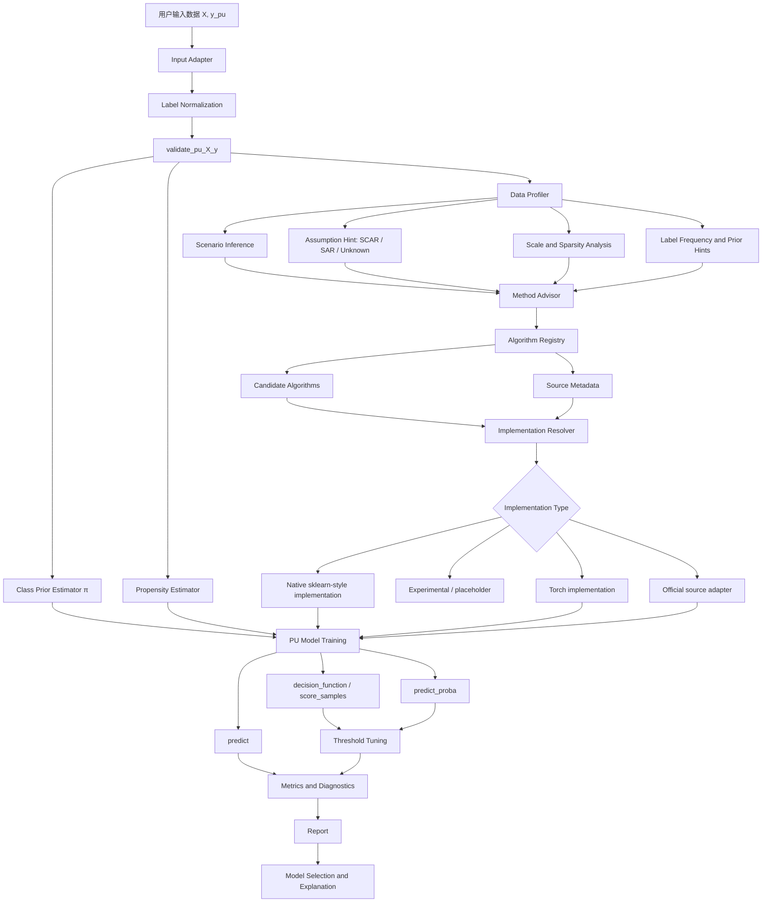

# Architecture Design

## 1. 架构目标

本 Toolbox 的架构目标是：

1. 保持核心包轻量；
2. 尽量兼容 `scikit-learn`；
3. 清晰区分类先验、标记倾向、损失函数、分类器和论文源码 adapter；
4. 支持先搭建框架，再逐个集成论文算法；
5. 支持经典算法、风险估计算法、SAR / Instance-Dependent 算法、深度表征算法和生成式算法逐步扩展；
6. 支持算法注册、自动推荐、诊断报告、benchmark regression 和 Agent skill。

核心架构原则是 **API contract first, algorithm implementation later**。即使暂时没有完成每篇论文算法的完整实现，也应先完成稳定的模块边界、元数据规范、测试桩和 adapter 接口。

---

## 2. 总体包结构

> 完整目录结构以 [`project_structure.md`](project_structure.md) 为权威来源。以下仅列出 `pu_toolbox/` 包内结构概要，用于说明模块分层。

```text
pu_toolbox/
  core/           # base.py, validation.py, labels.py, config.py, exceptions.py, random.py, tags.py
  datasets/       # synthetic.py, loaders.py, scar_simulator.py, sar_simulator.py, selection_bias_simulator.py, benchmark_catalog.py
  preprocessing/  # input_adapter.py, feature_checker.py, sparse_utils.py, representation.py
  prior/          # base.py, tice.py, alphamax.py, recpe.py, pen_l.py, wrappers.py
  propensity/     # base.py, scar.py, sar.py, elkan_noto.py, labeling_bias.py
  losses/         # base.py, upu.py, nnpu.py, pnu.py, convex_pu.py, distribution_alignment.py
  estimators/     # classic/, risk/, bias_aware/, deep/
  source_adapters/# base.py, registry.py, license.py, official_source.py, external_runner.py, matlab_adapter.py, torch_repo_adapter.py, chainer_adapter.py
  metrics/        # supervised.py, pu_estimated.py, diagnostics.py, calibration.py, assumption_checks.py
  model_selection/# split.py, scorer.py, threshold.py, validation_curve.py, prior_sensitivity.py, propensity_sensitivity.py
  advisor/        # data_profiler.py, method_selector.py, complexity_estimator.py
  registry/       # registry.py, metadata.py, aliases.py, source_metadata.py, source_policy.py
```

测试、示例、benchmark、文档、脚本等根目录结构见 [`project_structure.md`](project_structure.md)。

---

## 3. 模块分层

| 层 | 模块 | 作用 |
|---|---|---|
| Core | `core`, `preprocessing`, `registry` | 提供稳定 API、标签规范、输入校验、算法注册和元数据 |
| Estimation | `prior`, `propensity`, `losses` | 把类先验估计、标记倾向估计和 PU 损失函数解耦 |
| Algorithms | `estimators` | 实现或包装具体 PU 分类器 |
| Source Integration | `source_adapters` | 管理作者源码、旧框架源码、外部仓库和论文复现脚本 |
| Evaluation | `metrics`, `model_selection`, `benchmarks` | 评估、诊断、切分、阈值选择和 benchmark regression |
| User Layer | `advisor`, `examples`, `docs`, `agent_skill` | 推荐算法、生成报告、自然语言调用与教程 |

---

## 4. 数据流图



---

## 5. 核心 API

### 5.1 BasePUClassifier

```python
class BasePUClassifier(BaseEstimator, ClassifierMixin):
    family = "unknown"
    assumption = ("unknown",)  # tuple for immutability; registry uses list for JSON compat
    scenario = ("unknown",)
    requires_class_prior = False
    implementation_status = "api_only"

    def fit(self, X, y_pu, *, class_prior=None, sample_weight=None):
        raise NotImplementedError

    def predict(self, X):
        raise NotImplementedError

    def decision_function(self, X):
        raise NotImplementedError

    def predict_proba(self, X):
        raise NotImplementedError

    def get_pu_metadata(self):
        return {}
```

### 5.2 BasePriorEstimator

```python
class BasePriorEstimator(BaseEstimator):
    def fit(self, X, y_pu):
        raise NotImplementedError

    def estimate(self):
        raise NotImplementedError

    def confidence_interval(self):
        return None
```

### 5.3 BasePropensityEstimator

```python
class BasePropensityEstimator(BaseEstimator):
    def fit(self, X, y_pu):
        raise NotImplementedError

    def estimate(self):
        raise NotImplementedError

    def predict_propensity(self, X):
        raise NotImplementedError
```

### 5.4 BasePULoss

```python
class BasePULoss:
    requires_class_prior = True

    def __call__(self, positive_logits, unlabeled_logits, *, class_prior):
        raise NotImplementedError
```

### 5.5 BaseSourceAdapter

```python
class BaseSourceAdapter:
    source_status = "unknown"
    upstream_url = None
    license = "unknown"
    backend = "unknown"

    def is_available(self):
        raise NotImplementedError

    def build_estimator(self, **kwargs):
        raise NotImplementedError

    def run_reproduction_test(self, config):
        raise NotImplementedError
```

---

## 6. 输出接口规范

| 方法 | 是否必须 | 含义 |
|---|---|---|
| `fit(X, y_pu)` | 必须 | 训练模型 |
| `predict(X)` | 必须 | 输出离散标签 |
| `decision_function(X)` 或 `score_samples(X)` | 必须至少一个 | 输出连续分数 |
| `predict_proba(X)` | 可选 | 输出校准后的 `P(y=1\|x)` |
| `predict_label_proba(X)` | 可选 | 输出 `P(s=1\|x)` |
| `get_params()` / `set_params()` | 必须 | 支持 sklearn Pipeline / GridSearchCV |
| `get_pu_metadata()` | 推荐 | 输出假设、源码状态、类先验、训练诊断等信息 |

---

## 7. 类先验、标记倾向与损失函数

| 名称 | 符号 | 含义 | 相关方法 |
|---|---|---|---|
| 类先验 | `π` | 总体中真实正类比例 | Class-Prior Estimation、ReCPE、TIcE、AlphaMax |
| 常数标记倾向 | `c` | SCAR 下正类被标记的概率 | Elkan-Noto |
| 实例相关标记倾向 | `c(x)` | SAR 下每个样本被标记的概率 | LBE、PUSB |
| PU 风险 / 损失 | `R(f)` | 用 P/U 样本重写或校正监督风险 | Convex PU、uPU、nnPU、PNU、Dist-PU |

---

## 8. 算法注册表

每个算法都应注册元信息。元数据不仅用于推荐器，也用于判断能否优先调用作者源码。

```python
{
    "name": "nnPU",
    "aliases": ["non_negative_pu", "nnpu"],
    "family": "risk_estimation",
    "paper": "Positive-Unlabeled Learning with Non-Negative Risk Estimator",
    "scenario": ["case_control"],
    "assumption": ["SCAR"],
    "requires_class_prior": True,
    "supports_sparse": False,
    "supports_gpu": True,
    "backend": "torch",
    "maturity": "stable",
    "complexity": "medium",
    "recommended_data_size": "medium_to_large",
    "source_status": "official_exact",
    "upstream_url": null,
    "implementation_status": "official_adapter",
    "license": "unknown"
}
```

推荐的 `implementation_status` 枚举：

| 状态 | 含义 |
|---|---|
| `api_only` | 只有 API 契约和占位类，尚未实现训练逻辑 |
| `native` | Toolbox 内部 clean-room 实现 |
| `official_adapter` | 通过 adapter 调用作者/官方源码 |
| `official_aligned_native` | 参考官方训练逻辑后完成原生实现，并有对齐测试 |
| `third_party_reference_only` | 只把第三方实现作为参考，不作为核心依赖 |
| `experimental` | 研究版，API 可能变化 |

---

## 9. 论文方法到模块的映射

> 算法族总览和选型指南见 [`method_selection.md`](method_selection.md) §2–§5。下表仅关注论文 → 代码模块的映射关系。

| 方法/论文方向 | 主要模块 | 实现策略 |
|---|---|---|
| Class-Prior Estimation | `prior/pen_l.py`, `prior/wrappers.py` | 先实现统一接口，再补充估计器细节 |
| ReCPE | `prior/recpe.py` | 作为 class-prior wrapper，可接任意 base CPE |
| Elkan-Noto | `estimators/classic/elkan_noto.py`, `propensity/elkan_noto.py` | core 中 clean-room 实现 |
| Convex PU / uPU | `losses/convex_pu.py`, `losses/upu.py` | 先实现 loss，再包装 estimator |
| nnPU | `losses/nnpu.py`, `estimators/risk/nnpu.py` | 优先官方源码对齐，再迁移 Torch |
| PNU | `losses/pnu.py`, `estimators/risk/pnu.py` | 优先 adapter，后续统一为 Torch/sklearn wrapper |
| Centroid Estimation | `estimators/risk/centroid.py` | SAR / bias-aware 阶段实现，先定义接口 |
| LLSVM | `estimators/risk/llsvm.py` | 优先作者代码包 adapter，注意许可证 |
| Dist-PU | `losses/distribution_alignment.py`, `estimators/risk/dist_pu.py` | Torch extension，保留分布约束配置 |
| PUSB | `estimators/bias_aware/pusb.py` | selection bias baseline |
| LBE | `propensity/labeling_bias.py`, `estimators/bias_aware/lbe.py` | 抽象为 `PropensityEstimator` + classifier |
| Self-PU | `estimators/deep/self_pu.py` | Torch research extension |
| Information-Theoretic PU | `preprocessing/representation.py`, `estimators/deep/infomax_pu.py` | 先做 representation transformer |
| Weighted Contrastive PU | `estimators/deep/weighted_contrastive_pu.py` | 后期深度表征模块 |
| DGPU | `estimators/deep/dgpu.py` | 后期生成式模块，单独 research dependency |

---

## 10. 源码 adapter 设计

作者源码不应直接改变 Toolbox 的核心 API。建议统一经过 adapter 层。

```text
用户 API
  ↓
Algorithm Registry
  ↓
Implementation Resolver
  ↓
Native Estimator / Official Source Adapter / Experimental Estimator
  ↓
统一输出：predict、decision_function、predict_proba、metadata
```

adapter 必须处理：

1. 依赖检查；
2. 源码路径或外部包是否可用；
3. 输入格式转换；
4. 随机种子传递；
5. 训练日志捕获；
6. 输出转换；
7. 许可证与引用提示；
8. 与 paper-like benchmark 的结果对齐。

---

## 11. 评价、切分与复现

- `PUStratifiedKFold`、`PUStratifiedShuffleSplit` 应保证每个训练折含有 labeled positive；`PUTrainValidationSplit`、`PUGroupKFold` 为后续版本补充，当前仅做接口预留。
- 有真实 `y` 时使用标准监督指标，如 AUC、F1、Average Precision、Brier Score；
- 只有 PU 标签时使用 PU 估计指标，并明确假设；
- 诊断模块应包含 `prior_sensitivity_analysis`、`propensity_sensitivity_analysis`、`scar_assumption_warning` 和 `source_adapter_alignment_check`；
- benchmark 分为 smoke benchmark、synthetic benchmark、paper-like benchmark；
- 每个论文算法建议保留 `benchmarks/paper_like/<algorithm_name>/` 复现目录。

---

## 12. 架构总结

核心原则：

1. core 包保持轻量；
2. 深度学习依赖放入 optional extension；
3. 类先验、标记倾向、损失函数、分类器和源码 adapter 解耦；
4. 所有算法通过 registry 管理；
5. advisor 不直接依赖具体算法实现，而是依赖算法元数据；
6. 有官方源码的论文方法优先走 adapter 或 official-aligned native 实现；
7. 无源码方法使用 clean-room reimplementation；
8. SAR / Instance-Dependent PU 与 source adapter 体系是中长期差异化重点。
