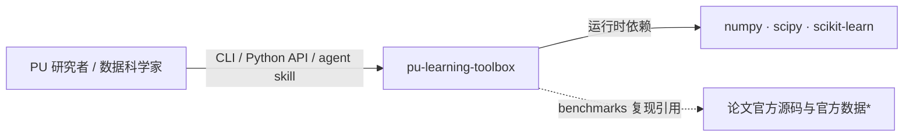
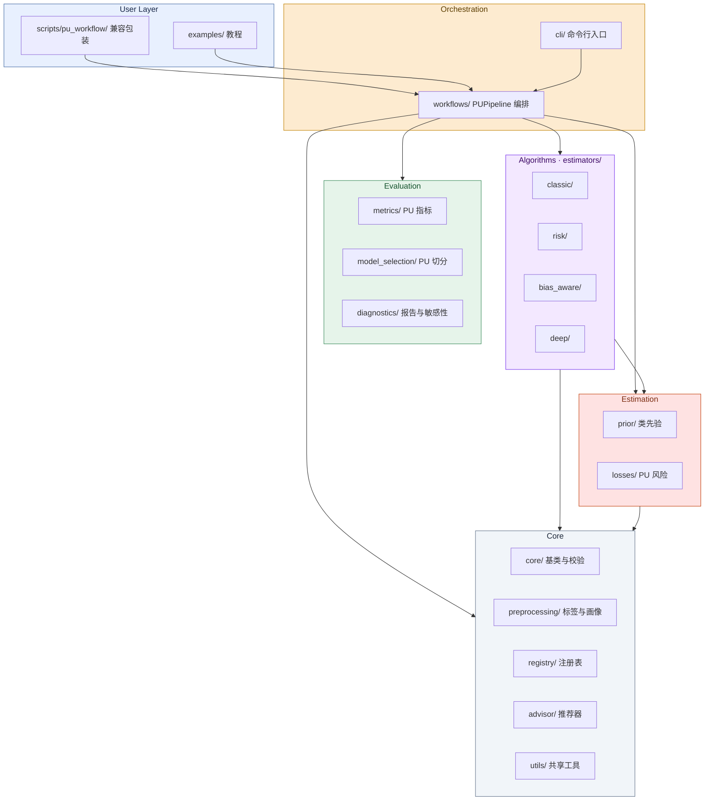

# 架构设计

## 1. 设计决策

设计决策与代价已迁移至 [docs/adr/](../adr/README.md)(ADR-0002 核心包
轻量化、ADR-0003 概念解耦、ADR-0004 registry 元数据驱动、ADR-0005 复现
可信度分级、ADR-0006 SAR 定位)。本文档只描述当前架构。

**与 `project_structure.md` 的分工**：本文档解释"为什么这样组织"（决策、
依赖方向、数据流）；文件清单与目录结构以 [`project_structure.md`](project_structure.md) 为权威来源。
**API 契约**：类的精确签名与方法语义以 [`user/reference/api.md`](../user/reference/api.md) 为权威来源，本文档不重复。

## 2. 模块分层

| 层 | 模块 | 作用 |
|---|---|---|
| Core | `core`, `preprocessing`, `registry`, `advisor`, `utils` | 稳定 API、标签规范、输入校验、SCAR/SAR 标签与数据生成、结构化数据画像、算法注册、元数据、算法推荐、共享工具 |
| Estimation | `prior`, `losses` | 类先验估计、PU 损失函数 |
| Algorithms | `estimators` | 实现具体 PU 分类器 |
| Evaluation | `metrics`, `model_selection`, `diagnostics` | PU 评估指标、PU 分层切分、结构化报告与假设敏感性 |
| Orchestration | `workflows`, `cli` | PUPipeline 端到端编排（画像→先验→训练→CV→评估→报告）与命令行薄封装 |
| User Layer | `examples`, `scripts/pu_workflow/`, pu-workflow skill | 教程、工作流兼容包装（委托 CLI 子命令）与 agent 流程 |

### 2.1 系统上下文



> \* 官方数据与历史环境由执行方提供，不内置工具箱（Dist-PU 需 Py3.7/numpy1.19 等）。

### 2.2 模块组件图



> 箭头表示调用方向（指向被依赖方）：编排层调用 Evaluation / Algorithms /
> Estimation / Core，Algorithms 使用 Estimation 与 Core，Estimation 依赖 Core。
> 分层与层间边为代表性概览，细粒度依赖以 [`project_structure.md`](project_structure.md)
> 目录树为准。

## 3. 数据流

```
用户输入 (X, y_pu) → 标签规范化 + 校验 → Data Profiler
    ↓
Registry → 候选算法 → 实现解析 (native / torch)
    ↓
类先验估计 + 标记倾向估计 → 模型训练 → 输出 (predict / decision_function / predict_proba)
    ↓
评估 + 诊断 → 报告
```

Data Profiler 输出 `PUDataProfile`：包含基础统计、特征质量、问题级别、行动建议和
标记机制证据。无审计真值时，SCAR/SAR 提示明确标记为非识别性筛查；提供 `y_true`
时仅在真实正例内部评估 selection dependence，避免把类别可分性误认为 SAR。

`build_diagnostic_report` 位于 `diagnostics`，只读取 Data Profiler、已拟合 estimator
和指标接口。它不训练模型，并将观测 PU、类先验依赖、监督 oracle 和
不可用指标分别标记，输出稳定 schema 的 JSON/Markdown 报告。

## 4. 算法注册与推荐

每个算法在 `registry` 注册元信息（name/aliases/family/scenario/assumption/
requires_class_prior/backend/maturity/source_status/implementation_status 等），
registry 据此管理发现和推荐。字段语义与枚举以 `pu_toolbox/core/tags.py` 为权威；
注册表实例见 `pu_toolbox/registry/builtin_methods.py`。

`advisor/` 模块提供 `recommend_methods(X, y_pu, ...)` 和 `recommend_from_profile(profile, ...)`，将数据画像与元数据匹配（用户侧的选型决策原理见 [`../user/concepts/method_selection.md`](../user/concepts/method_selection.md)）：

1. **硬过滤**：trainable、scenario、sparse 支持、class_prior 可用性
2. **软评分**：assumption 匹配 + maturity + source_status + 数据规模 + 训练成本 + GPU + 标记充足度
3. **风险提示**：自动生成全局和每方法的警告

评分权重通过 `ScoringConfig` dataclass 外化，开发者和用户可自定义维度权重
（含训练成本权重 `cost_max`）、枚举分数映射和数据规模阈值。缺省使用 `DEFAULT_CONFIG`。

模块结构：
- `_types.py` — 数据类（`MethodCandidate`、`RecommendationResult`）
- `rules.py` — 评分规则引擎（`ScoringConfig`、评分/警告函数）
- `recommender.py` — 管线编排（过滤 → 评分 → 排序 → 组装）

返回 `RecommendationResult`，支持 `to_json()` / `to_markdown()` / `save()`。
向后兼容：`from pu_toolbox.registry import recommend_methods` 仍可用。

## 5. 类先验、标记倾向与损失函数

| 概念 | 相关方法（✅ 已实现 / ⏳ 计划中） |
|---|---|
| 类先验 $\pi$ | ✅ ReCPE, ✅ penL1, ✅ KM1/KM2, † TIcE, † AlphaMax |
| 标记倾向 $c$ (SCAR) | ✅ Elkan-Noto |
| 标记倾向 $c(x)$ (SAR) | ✅ LBE, ✅ PUSB |
| PU 风险/损失 | ✅ uPU, ✅ nnPU, ✅ PNU, ✅ Dist-PU |

> † 扩展参考（不在 v1 范围内），非 17 篇核心论文方法（"17 篇"含 KLDCE 核化变体与 PUSBKernel，非严格论文数）。

## 6. 评价与切分

- `PUStratifiedKFold`、`PUStratifiedShuffleSplit`（已实现）：保证每个训练折含 labeled positive，保留 P/U 比例。
- PU-only 指标（不需要真实标签）：`pu_zero_one_risk`（PU 零一验证风险）、`pu_recall`（从已标记正样本估计召回率）、`pu_estimated_precision`（利用类先验估计精确率）、`pu_negative_rate`（无标记样本负预测率）。
- 有真实 $y$ 时使用标准监督指标包装（AUC, F1, Accuracy）。
- SCAR/SAR 证据：`scar_diagnostic` 在无真值时仅报告非识别性 P/U 筛查信号；
  提供审计 `y_true` 时，在真实正例内检查 selection dependence。
- Selection-bias 模拟：`make_sar_propensity`、`make_sar_labels` 和 `make_sar_dataset`
  支持常数、线性与非线性 propensity；隐藏 `y_true/propensity` 仅供 benchmark 使用。
- 结构化报告：`build_diagnostic_report` 组合数据画像、模型 metadata、PU 指标和
  可选监督指标，支持严格 JSON 与 Markdown 输出。
- 假设敏感性：`analyze_pu_sensitivity` 固定模型输出，以 $`P(S=1)=\pi\bar c`$
  检查类先验/平均标记倾向网格的相容性，并导出指标区间、JSON、Markdown 与 CSV；
  不承担 propensity 识别或逐假设模型重训。

## 7. 论文方法到实现的索引

每个方法的模块落点见 `project_structure.md` 目录树；论文公式、源码状态与
复现风险见各方法卡 [`../research/method_cards/`](../research/method_cards/)
（§8 源码状态与复现风险）。
