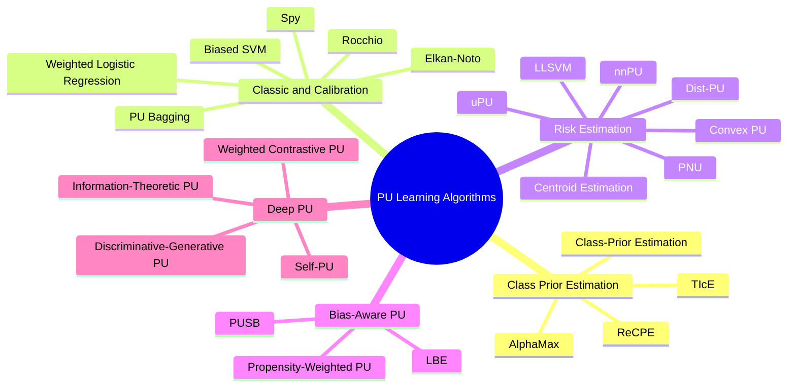
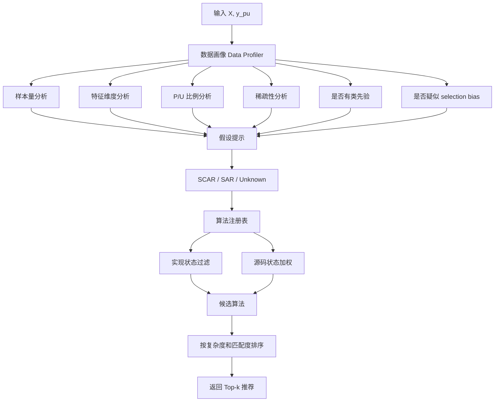

# Method Selection Guide

## 1. 方法选择目标

PU Learning 的难点不只是“实现算法”，而是帮助用户判断：

1. 当前数据更接近哪种采集场景；
2. SCAR 假设是否合理；
3. 是否需要估计类先验 `π`；
4. 是否需要建模标记倾向 `c` 或 `c(x)`；
5. 是否需要深度模型或表征学习；
6. 是否更重视速度、可解释性、精度还是论文复现；
7. 没有负类标签时如何评估模型；
8. 某个方法是否已经在 Toolbox 中实现；
9. 如果论文作者给出了源码，是否应优先使用官方源码 adapter。

因此 Toolbox 需要内置 **Method Advisor**，根据数据特点、假设、硬件、实现状态和源码状态推荐候选算法。

---

## 2. 算法族总览



---

## 3. 按数据场景选择

### 3.1 Single-training-set 场景

| 优先级 | 方法 | 原因 |
|---|---|---|
| 高 | Elkan-Noto | 简单、直观、适合作为 SCAR baseline |
| 高 | PU Bagging | 鲁棒、易用、不强依赖复杂数学假设 |
| 中 | Weighted Logistic Regression / Biased SVM | 工程上容易部署，可解释性较好 |
| 中 | Spy / Rocchio | 适合文本或高维稀疏特征 |
| 中 | PUSB / LBE | 如果怀疑已标记正样本存在选择偏差，应考虑 bias-aware 方法 |

### 3.2 Case-control 场景

| 优先级 | 方法 | 原因 |
|---|---|---|
| 高 | uPU | 无偏风险估计，理论清晰 |
| 高 | nnPU | 能缓解 uPU 负风险问题，适合深度模型 |
| 高 | PNU | 如果有部分负样本或半监督设置，可组合 PN / PU / NU 风险 |
| 中 | Dist-PU | 有 class prior 且需要深度分布约束时适用 |
| 中 | Self-PU | 正样本较少且希望利用自训练时适用 |

### 3.3 Selection-biased / SAR 场景

| 优先级 | 方法 | 原因 |
|---|---|---|
| 高 | PUSB | 直接面向 selection bias 的 PU 设置 |
| 高 | LBE | 显式估计 labeling bias / instance propensity |
| 中 | Centroid Estimation | 可作为 bias-aware 风险修正方向 |
| 中 | LLSVM | 大间隔标签校准，适合非深度基线 |
| 低 | 普通 SCAR 方法 | 只能作为对照，不应作为最终可信结论 |

---

## 4. 按标记机制选择

### 4.1 SCAR 假设

SCAR 表示：

```text
P(s=1 | y=1, x) = P(s=1 | y=1) = c
```

| 方法 | 是否需要类先验 | 是否适合 MVP | 备注 |
|---|---|---|---|
| Elkan-Noto | 不一定，需要估计 `c` | 是 | 经典概率校准 baseline |
| PU Bagging | 否 | 是 | 稳健启发式 baseline |
| Weighted Logistic Regression | 需要 `c` 或估计权重 | 是 | 适合工程部署 |
| uPU | 是 | 第二阶段 | case-control 设置更自然 |
| nnPU | 是 | 第二阶段 | 深度后端 |
| PNU | 是 | 第二阶段 | 适合有少量负样本或半监督扩展 |

### 4.2 SAR / Instance-Dependent 假设

SAR 表示：

```text
P(s=1 | y=1, x) = c(x)
```

| 方法 | 说明 | 优先级 |
|---|---|---|
| PUSB | selection bias 设置下的重要基线 | 高 |
| LBE | 显式建模 labeling bias | 高 |
| Centroid Estimation | 基于损失分解与质心估计 | 中 |
| LLSVM | 大间隔标签校准 SVM | 中 |
| SAR synthetic benchmark | 用来验证 SCAR 方法失效情况 | 高 |

---

## 5. 按数据规模与特征类型选择

| 数据特点 | 推荐方法 |
|---|---|
| 小数据、低维、需要快速基线 | Elkan-Noto、Weighted Logistic Regression |
| 小数据、高维文本 | Rocchio、Spy、Biased SVM、PU Bagging |
| 中等数据、需要稳健基线 | PU Bagging、Biased SVM |
| 大数据、类先验已知、有 GPU | nnPU、Dist-PU |
| 大数据、类先验未知 | 先用 TIcE / AlphaMax / ReCPE 估计 `π`，再用风险估计方法 |
| 怀疑标记有偏 | PUSB、LBE、Centroid Estimation、LLSVM |
| 图像或表征学习任务 | Self-PU、InfoMax PU、Weighted Contrastive PU |
| 生成式增强需求 | DGPU，作为后期研究扩展 |
| 流式数据 | Online PU，作为后续扩展 |
| 图结构数据 | Graph PU，作为后续扩展 |

---

## 6. 论文方法与 Toolbox 推荐定位

| 表格方向 | 方法/论文 | 推荐定位 |
|---|---|---|
| class prior estimation | Class-Prior Estimation | CPE baseline，支撑风险估计 |
| class prior estimation | ReCPE | 高优先级 wrapper，用于缓解传统 CPE 高估问题 |
| risk-consistent / calibration | Elkan-Noto | core baseline |
| risk-consistent loss | Convex PU / uPU | 风险估计基础 |
| risk-consistent loss | nnPU | 深度 PU 标准基线 |
| risk-consistent loss | PNU | 半监督风险组合扩展 |
| risk-consistent loss | Centroid Estimation | bias-aware / SAR 扩展 |
| risk-consistent loss | LLSVM | 非深度大间隔校准基线 |
| risk-consistent loss | Dist-PU | 深度分布对齐方法 |
| bias-aware PU | PUSB | selection bias 重点方法 |
| bias-aware PU | LBE | instance-dependent / labeling bias 重点方法 |
| deep / self-training | Self-PU | 自训练深度 PU 代表 |
| deep / representation | Information-Theoretic PU | 高维表征学习方向 |
| deep / representation | Weighted Contrastive PU | 对比学习方向，后期实现 |
| deep / generative | DGPU | 生成式研究方向，最后实现 |

---

## 7. 推荐器设计

### 7.1 输入

```python
recommend_algorithms(
    X,
    y_pu,
    scenario="unknown",
    assumption="unknown",
    class_prior=None,
    prefer_interpretability=True,
    prefer_official_source=True,
    require_available_implementation=True,
    max_training_time="medium",
    hardware="cpu",
    top_k=3
)
```

### 7.2 输出

```python
[
    {
        "algorithm": "ElkanNotoPUClassifier",
        "reason": "适合小中型数据，接口简单，可解释性较好",
        "assumption": ["SCAR"],
        "requires_class_prior": False,
        "hardware": "CPU",
        "complexity": "low",
        "implementation_status": "native",
        "source_status": "third_party_only"
    },
    {
        "algorithm": "BaggingPUClassifier",
        "reason": "不依赖复杂模型，适合快速构建稳健基线",
        "assumption": ["heuristic"],
        "requires_class_prior": False,
        "hardware": "CPU",
        "complexity": "medium",
        "implementation_status": "native",
        "source_status": "third_party_only"
    },
    {
        "algorithm": "LBEClassifier",
        "reason": "适合怀疑标记机制与样本特征相关的 SAR 场景",
        "assumption": ["SAR"],
        "requires_class_prior": False,
        "hardware": "CPU/GPU depending on implementation",
        "complexity": "high",
        "implementation_status": "api_only",
        "source_status": "official_exact"
    }
]
```

### 7.3 推荐器过滤逻辑

```text
读取数据画像
    ↓
判断数据规模、稀疏性、P/U 比例
    ↓
读取用户给出的 scenario / assumption / class_prior
    ↓
从 registry 过滤算法
    ↓
如果 require_available_implementation=True，则排除 api_only 算法
    ↓
如果 prefer_official_source=True，则有官方源码或已对齐实现的算法加权
    ↓
根据复杂度、硬件、假设匹配度排序
    ↓
返回 Top-k 并解释风险
```

---

## 8. 推荐器数据流



---

## 9. 算法元数据

每个算法都应在注册表中提供完整元数据：

```python
{
    "name": "Dist-PU",
    "aliases": ["dist_pu", "distribution_pu"],
    "family": "risk_estimation",
    "paper": "Dist-PU: Positive-Unlabeled Learning from a Label Distribution Perspective",
    "scenario": ["case_control"],
    "assumption": ["SCAR"],
    "requires_class_prior": True,
    "supports_sparse": False,
    "supports_gpu": True,
    "backend": "torch",
    "maturity": "research",
    "complexity": "high",
    "recommended_data_size": "medium_to_large",
    "implementation_status": "official_adapter",
    "source_status": "official_exact",
    "upstream_url": null
}
```

---

## 10. MVP 方法选择策略

第一版 Toolbox 不应覆盖所有算法，而应先支持一组稳定、易用、代表性强的方法，同时为论文算法保留 registry 占位。

| 模块 | MVP 算法 |
|---|---|
| 经典分类器 | Elkan-Noto、PU Bagging、Weighted Logistic Regression、Biased SVM |
| 类先验估计 | TIcE、AlphaMax，外加 ReCPE 接口占位 |
| 切分 | PUStratifiedKFold、PUStratifiedShuffleSplit |
| 指标 | label frequency、Lee-Liu score、退化预测检测 |
| 推荐器 | 基于规则的 Top-3 推荐 |
| 源码策略 | 读取 `resources_optimized.md` 中的 source status；有官方源码的方法优先 adapter |

---

## 11. 方法选择中的风险提示

推荐器必须显式提示以下风险：

1. SCAR 不成立时，Elkan-Noto、uPU、nnPU 等结果可能有偏；
2. class prior 估计错误会显著影响风险估计方法；
3. labeled positive 过少时，深度方法不一定优于简单 baseline；
4. selection bias 明显时，应优先尝试 PUSB / LBE / SAR 方法；
5. 只有 PU 标签时，不能把 PU 估计指标等同于真实监督指标；
6. 使用官方源码 adapter 时，需要检查许可证、依赖和数据处理差异；
7. `api_only` 算法只能展示接口和规划，不能用于训练（详见 [`architecture.md`](architecture.md) §8 `implementation_status` 枚举定义）。

---

## 12. 方法选择总结

推荐使用顺序：

```text
先检查数据场景
    ↓
判断 SCAR 是否合理，是否存在 selection bias
    ↓
判断是否需要估计类先验 π
    ↓
根据数据规模、特征类型和硬件选择算法族
    ↓
检查算法 implementation_status 与 source_status
    ↓
优先使用可运行且有官方源码对齐的方法
    ↓
至少给出 3 个候选算法
    ↓
通过 PU 专用指标、敏感性分析和诊断模块比较结果
```
