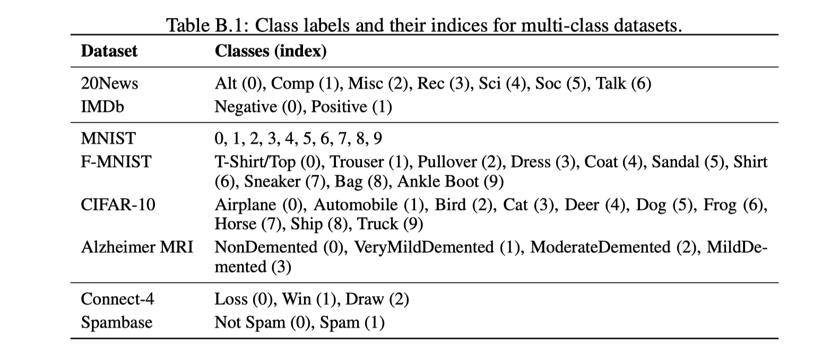

# PU 调研实验协议

> 本协议为**实验方案要求纲要**：规定实验目标、数据与划分、选模协议、结果分组与交付验收，
> 具有长期参考价值。本协议来自调研工作区实验要求 v2（原始稿存于外部工作区，未入版本控制）；
> **修订在仓库内维护**；原始上下文与修订历程仍保存在外部工作区。
>
> 相关文档：技术实现与推进状态（现状差距、前置工作项、锁定细节、进度审计）见
> [implementation_plan.md](implementation_plan.md)；
> 与双架构计划的关系见 [dual_architecture_plan.md §7](../../dev/dual_architecture_plan.md)；
> 算法方法实现状态与台账见 [METHOD_CARDS](../method_cards/)。

## 0. 参考文献

1. *Accessible, Realistic, and Fair Evaluation of Positive-Unlabeled Learning Algorithms*
   （Wang et al., ICLR 2026）
   对应源码仓库：https://github.com/wu-dd/PUBench
2. *PU-Bench: A Unified Benchmark for Rigorous and Reproducible PU Learning*（Chen et al., 2026）
   对应源码仓库：https://github.com/XiXiphus/PU-Bench

## 1. 实验目标

### 1.1 目标概述

1. 不同类别的 PU 学习方法，各有什么优势？在什么特定情况下，哪些方法好？
2. 不同标记频率下，各 PU 学习方法的稳定性如何？
3. 和全监督学习相比，还相差多少，有何提升方向？

### 1.2 补充说明

- 目标 1 中的不同类别使用 Survey 的分类体系：A. data inspired methods、
  B. objective inspired methods、C. optimization inspired methods；此外效仿参考文献 2 的
  设计，在这三类算法之外额外设置全监督学习基准结果 oracle 上界。
- 目标 1 中"算法具有优势"通过两套**独立**的模型选择协议评判：PA（主 PU 协议）与 OA
  （使用真实验证标签的 oracle 对照）。每套协议分别选择超参数和 checkpoint，再在独立真实
  标签测试集上汇报 Accuracy 的五次重复均值与标准差。AUC、F1 score、Precision、Recall
  仅作为最终测试阶段的附加指标记录在日志中；它们不参与超参数或 checkpoint 选择，也不与
  PA/OA 合成为单一分数。
- 目标 1 中"特定情况"指原始数据集本身、数据抽样方式、backbone、测试指标、class prior、
  标注概率、以及其它相关参数：例如参考文献 2 中研究的训练时间和峰值 GPU 内存。
- 目标 2 中的"标记频率"是指真实正例中被标注为正例标签的平均比例，即参考文献 1、2 中的
  **label ratio / label frequency**：$`c=P(S=1\mid Y=1)`$。它不是类先验；类先验单独记为
  $`\pi=P(Y=1)`$。

## 2. 数据集

### 2.1 原始数据集选择

选用 8 个数据集，涉及图片、文本、表格三类模态（参考文献 1、2）：

- 文本数据集：IMDB，20News
- 图片数据集：CIFAR-10，ADNI，MNIST，F-MNIST
- 表格数据集：Spambase，Connect-4

> 处理路线参考 PU-Bench 的实际做法：文本先用固定的 `all-MiniLM-L6-v2` 生成 384 维 SBERT
> 向量，再作为二维数值特征输入 MLP；表格输入 MLP；图像使用 CNN。PU-Bench 并未对文本进行
> 端到端 Transformer 训练。

### 2.2 原始数据集基本信息及正负样本划分原则

二元化映射锁定为：20News `0,1,2,3 vs 4,5,6`，IMDb `1 vs 0`，MNIST 偶数 vs 奇数，
F-MNIST `0,2,3,4,6 vs 1,5,7,8,9`，CIFAR-10 `0,1,8,9 vs 2--7`，ADNI `0 vs 1,2,3`，
Connect-4 Win vs Loss/Draw，Spambase Spam vs Not Spam（映射依据：论文 2 Table B.2，
即上文 `assets/Dateset_PU.png`）。数据版本或标签编码发生变化时，必须提供映射转换审计记录；
不得因方法表现调整正负类定义。

### 2.3 PU 数据集生成

1. 统一采用 OS 数据生成方式，保证基础训练数据的一致性。`os_or_ts` 表示算法使用的
   **训练数据视图**：`os` 表示原始 OS 视图；`ts` 表示对原生 TS 方法启用 TS-OS 校准后的
   TS-compatible 视图。基础数据始终是 OS，而不是在 `ts` 时重新独立抽样 TS 数据。

   > TS-OS 校准不是一次性改变数据文件，而是在训练期间对每个 mini-batch 执行
   > $`D_{U}^{k} \leftarrow D_{U}^{k}\cup D_{P}^{k}`$：正例批次仍用于正例损失，同时被并入 TS 方法的
   > 未标记损失输入。验证集和测试集保持原始 OS 协议，不进行该合并。默认 `os_or_ts=os`；
   > 仅对已经在方法台账中标注为原生 TS、且训练接口允许替换未标记损失输入的方法设置
   > `os_or_ts=ts` 并启用校准。该参数不得被解释为重新生成严格独立抽样的 TS 数据。

2. 原始数据集生成 PU 数据集时，对正标签的观测采用标记频率 **label ratio / label frequency**
   $`c\in\{0.1,0.3,0.5\}`$。研究 $`c`$ 时固定同一数据集的总体类先验 $`\pi`$、数据划分、标注机制及
   其余实验参数；具体 OS 标记方式见参考文献 1。SCAR 以 $`n_{L}=\mathrm{round}(c n_{+})`$ 为
   固定抽样数，从全部正例中均匀无放回抽取，并记录 $`c_{\mathrm{realized}}=n_{L}/n_{+}`$；不采用
   逐样本 Bernoulli 标注。

   > SCAR（instance independent）为主实验。SAR 为独立压力测试：
   > - 仅取 $`c\in\{0.1,0.5\}`$，并须与 PU-Bench 的 SAR 设定保持一致（实现锁定细节见
   >   [implementation_plan.md](implementation_plan.md) §2）；
   > - 保持固定 $`n_{L}`$；每次保存请求与实际标记数、权重/score 版本和生成 seed 一并记录；
   > - SAR 下 PA 仅可作为诊断日志，正式模型选择及结论只使用 OA；
   > - 所有算法可在通过输入/训练门禁后参加 SAR OA 测试，但须按其原生假设是否匹配 SAR
   >   标为"原生适用"或"假设违背鲁棒性"。

### 2.4 训练集、验证集、测试集划分

按数据角色、切分规则、流程与任务要求四部分列出，条目编号全章节连续。

**（一）四份数据的角色与用途**

1. `train` 仅含 PU 标签，用于训练；`pu_val` 仅含标记正例与未标记样本，供 PA 选模；
   `clean_val` 含真实标签，仅供 OA oracle 对照；`test` 含真实标签，但不得参与模型选择。
2. PA 执行不得向模型或回调暴露 `clean_val`/`test`，OA 才注入 `clean_val`。无法移除真实
   验证标签依赖的方法标为 `PA-ineligible`，仅进入 OA/补充表。

**（二）切分与重生成规则**

3. 对本次实验而言，研究团队作为工具箱用户，按参考文献 1、2 的划分思想和数据集约束自行准备
   训练集、PU 验证集、真实标签验证集与测试集，并将其传入接口。保留 PU-Bench 的独立测试集；
   从原始训练源分层留出 10% 验证池，等分为 5% `pu_val` 和 5% `clean_val`，其余 90% 为
   `train`。`pu_val` 与 `clean_val` 必须不重叠，`clean_val` 和 `test` 保持自然类先验。
4. 五个实验 seed 共同决定原始 split、SCAR/SAR 标记和训练随机性；同一 seed 下所有方法、
   PA/OA、PN oracle 及所有 $`c`$ 共享同一底层 split，同一 $`c`$ 共享相同 P/U 标记结果。扫描 $`c`$
   时仅重生成 $`S`$ 标签，不改变样本、split 或 $`\pi_{population}`$。

**（三）训练、选模与评测流程**

5. 每个候选配置以固定 epoch 预算完整训练一次，记录所有 epoch 的 PA、OA 与 checkpoint；随后
   **离线独立**选择 PA 与 OA 各自最优的"超参数 + checkpoint + 阈值"。选中 checkpoint 直接在
   独立 `test` 评测，不与验证集重新合并训练。
6. PA 与 OA 必须分别保存选择 artifact、checkpoint 和测试结果，不能用 OA 选择的模型替代 PA
   协议的结果。

**（四）任务要求：接口、交付物与留痕**

7. 本实验要求工具箱提供 `fit(model, train, pu_val, clean_val, test)` 或等价接口，并以已完成
   split 和预处理的四路 `DatasetBundle` 作为输入；工具箱不负责切分原始数据，训练集、验证集和
   测试集均由用户提供。
8. 工具箱必须具备"利用用户给的数据和模型要求，训练出模型"这一功能，故需要提供丰富的可 DIY
   参数的接口：训练模型的函数、生成数据的函数等。DIY 接口是工具箱面向所有用户开放的能力；
   本实验的候选配置与超参数由 §5.3 的中心注册表统一管理，实验榜单仅使用注册表登记的配置；
9. 提供一个官方示例脚本：读取用户准备的四份数据，并利用工具箱函数完成完整 PU 学习、模型选择
   和测试流程。
10. PN oracle 在与 PU 运行相同的底层 `train` 分区使用完整真实 PN 标签，采用同一表征、
    backbone、split、候选预算与五个 seed；它仅以 `clean_val` 的真实 Accuracy 选模，表中标为
    `PN oracle (OA only)`，不得伪造 PA 结果。
11. 应记录随机种子、样本索引和 split manifest；这是一项实验协议要求，不是工具箱的自动数据
    划分职责。

> 上述要求的当前工具箱实现状态、`ExperimentRunner` 层结论与实现侧自动验证要求见
> [implementation_plan.md](implementation_plan.md) §1。

### 2.5 特征提取框架（backbone）

**已确认协议：采用 PU-Bench 架构思路**——"同一数据集内统一表征、backbone、训练预算与调参
预算"；跨数据集只比较趋势，不把不同模态的绝对指标合并为单一排名。这是按数据集统一，而不是
要求所有模态或所有数据集使用同一个 backbone。

1. 图像数据集：采用 ResNet-18 作为 backbone（参考 PU-Bench 的数据集内统一训练与评估协议）。
   若未来改用 PU-Bench 的数据集专用 backbone，须单独配置和报告，不覆盖本实验的 ResNet-18
   主协议；
2. 表格数据集：采用 MLP 作为 backbone；
3. 文本数据集：采用固定的 `all-MiniLM-L6-v2` 生成 384 维 SBERT 向量，再输入 MLP；不将
   端到端 Transformer 作为当前实验前提；
4. 同一数据集内，所有进入同一榜单的方法必须使用相同图像表征和相同训练预算。oracle 与各 PU
   方法必须使用同一份划分和同一表征/backbone；因 backbone 或输入表征不同而得到的结果应单列
   报告，不得混入同一主榜单；
5. 灰度与 RGB 的输入处理保持一致（具体实现口径见
   [implementation_plan.md](implementation_plan.md) §3）；输入尺寸、首层设置、归一化和增强
   均须入 manifest。方法私有网络只能作为 `benchmark-adapted` 路径报告；
6. 所有可学习预处理统计量仅在该 seed 的 `train` 拟合并冻结，图像增强仅用于训练。文本须记录
   `all-MiniLM-L6-v2` 的模型 revision、384 维输出及 embedding cache hash。

#### 与双架构扩展计划的关系

双架构计划的结论：**双架构计划不是文本 SBERT 向量或表格 MLP 路径的前置条件；它是完成图像
数据集公平比较的部分前置工作**；实施工作项与独立的后置工作项见
[implementation_plan.md](implementation_plan.md) §4，计划全文见
[dual_architecture_plan.md](../../dev/dual_architecture_plan.md) §7。

## 3. class prior 以及相关参数设置

1. 本实验将类先验明确区分为：总体/测试分布类先验 $`\pi_{population}=P(Y=1)`$、构造后训练对象
   的 $`\pi_{train}`$，以及未标记集内的 $`\pi_{U}`$。$`\pi_{population}`$ 定义为每个 seed 于同一
   完整二元化数据池（分层划分前的完整池）的正例经验比例，故其为所有 seed 共享的常量；它是
   数据生成 metadata，不从 PU 标签、`train`、`U` 或 `test` 子集反推。扫描标记频率 $`c`$ 时固定
   每个数据集的 $`\pi_{population}`$，并在每次运行的 metadata 中记录三者及实际实现的 $`c`$；
2. 主实验可向需要总体类先验的算法和 PA 传入真实 $`\pi_{population}`$，但结果必须标注为
   `known-prior`（oracle-prior）设定。不得将 $`\pi_{U}`$ 或 $`\pi_{train}`$ 不加区分地传入所有名为
   `class_prior` 的参数；具体参数语义以算法原文和官方实现为准；
3. 后续可单独开展 $`\pi`$ 估计器敏感性实验；该实验不得与使用真实 $`\pi_{population}`$ 的主结果
   混合；
4. PU 学习算法的参数选择参考文献 1、2、算法原文和官方代码，并记录候选参数池、选择指标、
   随机种子和最终配置；
5. 连续 score 的分类阈值是预注册候选配置的一部分，PA/OA 分别选择最佳"超参数 + checkpoint +
   阈值"；仅输出硬标签的方法使用其原生规则并记录为不可调阈值。

## 4. 需实现的算法

- **A.** PAN、GEN-PU、PULNS、RP、CVIR、Holistic-PU、P3MIX
- **B.** uPU、nnPU、KLDCE、VPU、Dist-PU、PULDA、PUSB、LBE
- **C.** PUET、Grad-PU、Robust-PU、Split-PU、LAGAM、Self-PU
- **oracle**：全监督学习基准结果上界（21 个 PU 方法 + 1 个 oracle，合计 22 个目标方法）

每个方法还需维护**实现台账**：原始论文与代码版本、当前实现状态、`native_sampling_assumption`、
`run_view`（OS/TS-compatible）、`calibration_applied`、`prior_semantics`、`adaptation_level`
（`source-faithful`/`benchmark-adapted`）、支持模态与 backbone。

每个"数据集 × 方法"须通过可运行、先验语义确认、OS/TS 状态明确与 backbone 路径可比四项门禁后
才能进入主榜；未通过者公开列出原因。完整主榜以 22 个目标方法全部通过相应门禁为发布条件；
在此之前只可发布明确标为 `pilot / partial benchmark` 的部分结果。

> 当前源码审计与接入验收流程（`source-faithful` 判定、冒烟/对照要求）见
> [implementation_plan.md](implementation_plan.md) §5。

## 5. 结果、复现与交付验收

1. 结果固定分为四组，且不混合排名：SCAR--PA 主榜、SCAR--OA oracle 对照、SAR--OA 压力测试
   （LBE-A、LBE-B 分开）和 PN oracle。每组按数据集、训练路径（端到端/feature-adapter）和原生
   假设分层；跨数据集只比较趋势，不生成总排名；
2. "具有优势"仅在同一数据集、$`c`$、协议和训练路径内，以独立 `test` Accuracy 五次重复均值
   比较；同步报告标准差、单配置训练成本、完整调参成本和峰值显存。暂不预设显著性检验门槛；
3. 所有方法在同一数据集、$`c`$ 和协议下使用相同候选池、epoch 上限与早停规则；候选池按论文/
   官方代码预注册并记录候选数。超参数通过中心注册表统一管理（注册表设计参考见
   [implementation_plan.md](implementation_plan.md) §6）；
4. 同一数据集内统一最大 epoch、batch-size 候选范围、资源上限和调参预算；环境只规定 GPU/CPU、
   显存等级和软件栈等大类，不将本机硬件写入方案。实际型号、驱动和资源限制写入 artifact。
   单配置成本从模型初始化到最终 epoch，包含训练和每 epoch 验证，不含下载、SBERT 生成、split
   和 PU 数据生成；共享预处理时间单列。总调参成本包含全部候选配置和五个 seed；峰值显存取该
   全过程最大已分配 GPU memory；
5. NaN、OOM、接口不兼容或超时仅允许以相同 seed 重试一次；仍失败则记录失败并从该条件排名
   排除。修改参数后重跑视为新候选配置，须按同一条件对全部方法一致处理；
6. 每个运行 artifact 必须固化：代码 commit、依赖锁文件、Python/PyTorch/CUDA/GPU 信息、方法
   和数据配置、中心超参数注册表版本、seed、split/label manifest、选择 artifact 和结果 schema
   版本。缺失任一项的结果标记为不可复现，不进入汇总主表；
7. 在上述条件满足后，再结合各方法局限性、可结合/改进点以及三类方法的优缺点分析实验结果。
   任何解释必须区分"文献事实""本实验观测"和"推断"。

> pilot 前的基础设施验收清单与技术实现章节见
> [implementation_plan.md](implementation_plan.md) §7。

## 6. 实验过程中的注意点

1. 各个方法可能/实际存在的局限性、优越性；
2. 各方法相对其他方法能够改进（结合）的地方；
3. 各类方法的优缺点；
4. 各类方法之间有什么能够改进（结合）的地方。
