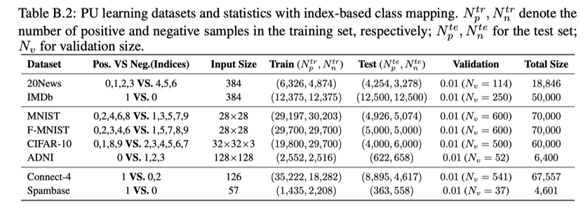

# PU 学习调研实验协议

> 本协议来自调研工作区实验要求 v2（`Experimental_Request_0902.md`，科研工作区原始稿，
> 未入版本控制），是 **PU Learning Toolbox 的第一次实际应用**。本仓库内为协议规范——
> 修订在仓库内维护；原始上下文与修订历程仍保存在外部工作区。
>
> 协议相关：方法实现状态与算法台账见 [METHOD_CARDS](method_cards/)；
> 与双架构计划的关系见 [dual_architecture_plan.md §7](../dev/dual_architecture_plan.md)。

## 0. 参考文献

1. *Accessible, Realistic, and Fair Evaluation of Positive-Unlabeled Learning Algorithms*（Wang et al., ICLR 2026）
   对应源码仓库：https://github.com/wu-dd/PUBench
2. *PU-Bench: A Unified Benchmark for Rigorous and Reproducible PU Learning*（Chen et al., 2026）
   对应源码仓库：https://github.com/XiXiphus/PU-Bench
## 1. 实验目标

### 1.1 目标概述

1. 不同类别的 PU 学习方法，各有什么优势？在什么特定情况下，哪些方法好？
2. 不同标记频率下，各 PU 学习方法的稳定性如何？
3. 和全监督学习相比，还相差多少，有何提升方向？

### 1.2 补充说明

- **分类体系**：目标 1 采用 Survey 的分类体系——A. data inspired、B. objective inspired、
  C. optimization inspired；三类算法之外额外设置全监督学习基准结果 oracle 上界。
- **选模协议**：算法"具有优势"通过两套**独立**的模型选择协议评判——PA（主 PU 协议）
  与 OA（使用真实验证标签的 oracle 对照）。每套协议分别选择超参数和 checkpoint，
  再在独立真实标签测试集上汇报 Accuracy 的五次重复均值与标准差。AUC、F1 score、
  Precision、Recall 仅作为最终测试阶段的附加指标记录在日志中；它们不参与超参数或
  checkpoint 选择，也不与 PA/OA 合成为单一分数。
- **"特定情况"**：指原始数据集本身、数据抽样方式、backbone、测试指标、class prior、
  标注概率，以及其它相关参数（如训练时间和峰值 GPU 内存）。
- **标记频率的定义**：目标 2 的"标记频率"指真实正例中被标注为正例标签的平均比例，
  即参考文献 1、2 中的 **label ratio / label frequency**：$`c=P(S=1\mid Y=1)`$。
  它**不是**类先验；类先验单独记为 $`\pi=P(Y=1)`$。

## 2. 数据集

### 2.1 原始数据集选择

选用 8 个数据集，涉及图片、文本、表格三类模态（参考文献 1、2）：

- 文本数据集：IMDB，20News
- 图片数据集：CIFAR-10，ADNI，MNIST，F-MNIST
- 表格数据集：Spambase，Connect-4

> 处理路线参考 PU-Bench：文本先用固定的 `all-MiniLM-L6-v2` 生成 384 维 SBERT 向量，
> 再作为二维数值特征输入 MLP；表格输入 MLP；图像使用 CNN。PU-Bench 并未对文本进行
> 端到端 Transformer 训练。

### 2.2 原始数据集基本信息及正负样本划分原则

### 2.3 PU 数据集生成

1. **统一采用 OS 数据生成方式**，保证基础训练数据的一致性。`os_or_ts` 表示算法使用
   的**训练数据视图**：`os` 表示原始 OS 视图；`ts` 表示对原生 TS 方法启用 TS-OS
   校准后的 TS-compatible 视图。基础数据始终是 OS，而不是在 `ts` 时重新独立抽样
   TS 数据。
   > TS-OS 校准不是一次性改变数据文件，而是在训练期间对每个 mini-batch 执行
   > $`D_U^k \leftarrow D_U^k\cup D_P^k`$：正例批次仍用于正例损失，同时被并入 TS
   > 方法的未标记损失输入。验证集和测试集保持原始 OS 协议，不进行该合并。默认
   > `os_or_ts=os`；仅对已经在方法台账中标注为原生 TS、且训练接口允许替换未标记
   > 损失输入的方法设置 `os_or_ts=ts` 并启用校准。该参数不得被解释为重新生成严格
   > 独立抽样的 TS 数据。
2. 原始数据集生成 PU 数据集时，对正标签的观测采用标记频率 $`c\in\{0.1,0.3,0.5\}`$。
   研究 `c` 时固定同一数据集的总体类先验 $\pi$、数据划分、标注机制及其余实验参数；
   具体 OS 标记方式见参考文献 1。
   > 结合工具箱实际情况：SCAR/SAR 两种正标签标记机制的设计已比较完备（当年设计
   > 重点）；本实验默认 SCAR（instance independent），另给几个 SAR（dependent）
   > 类型供选择。

### 2.4 训练集、验证集、测试集划分

1. 要求工具箱提供 `fit(model, train, pu_val, clean_val, test)` 或等价接口；工具箱
   **不负责切分原始数据**，训练集、验证集和测试集均由用户提供。`pu_val` 仅含标记
   正例与未标记样本，供 PA 选模；`clean_val` 含真实标签，仅供 OA oracle 对照；
   `test` 含真实标签，但不得参与模型选择。
2. 工具箱必须具备"利用用户给的数据和模型要求，训练出模型"的能力，故需要提供丰富
   的可接口 DIY 参数的函数——训练模型的函数、生成数据的函数等。
3. 提供一个**官方示例脚本**：读取用户准备的四份数据，并利用工具箱函数完成完整 PU
   学习、模型选择和测试流程。
4. 对本次实验而言，研究团队作为工具箱用户，按参考文献 1、2 的划分思想和数据集约束
   自行准备训练集、PU 验证集、真实标签验证集与测试集，并传入接口。应记录随机种子、
   样本索引或 split manifest——这是实验协议要求，不是工具箱的自动数据划分职责。
   PA 与 OA 必须分别运行并保存各自选择的配置、checkpoint 和测试结果；**不能用 OA
   选择的模型替代 PA 协议的结果**。

### 2.5 特征提取框架（backbone）

**已确认协议：采用 PU-Bench 架构思路**——"同一数据集内统一表征、backbone、训练预算
与调参预算"；跨数据集只比较趋势，不把不同模态的绝对指标合并为单一排名。按数据集
统一，而不是要求所有模态或所有数据集使用同一个 backbone。

1. 图像数据集：ResNet-18 作为 backbone（参考 PU-Bench 的数据集内统一训练与评估协议）。
   原方案中的 ResNet-34 因当前 Toolbox 未集成且算力限制不作默认选择；若未来改用
   PU-Bench 的数据集专用 backbone，须单独配置和报告，不覆盖本实验的 ResNet-18 主协议；
2. 表格数据集：MLP 作为 backbone；
3. 文本数据集：固定的 `all-MiniLM-L6-v2` 生成 384 维 SBERT 向量，输入 MLP；不将
   端到端 Transformer 作为当前实验前提；
4. 同一数据集内，所有进入同一榜单的方法必须使用相同图像表征和相同训练预算。oracle
   与各 PU 方法必须使用同一份划分和同一表征/backbone；因 backbone 或输入表征不同
   而得到的结果应单列报告，不得混入同一主榜单。

#### 与双架构扩展计划的关系

双架构计划不是文本 SBERT 向量或表格 MLP 路径的前置条件；它是完成图像数据集公平比较
的部分前置工作。为按 PU-Bench 协议在图像上比较所需算法，以下工作纳入实验计划：

1. **统一图像 encoder/backbone 配置**：在 EncoderFactory/配置/报告中支持本实验选定
   的图像 backbone、归一化和数据增强，并记录其版本与参数（当前已有的 CNN13、
   ResNet-18、ResNet-50 不代表已复现 PU-Bench 的各数据集专用 CNN）；
2. **完善算法能力台账与门禁**：逐算法声明 `native_mlp`、`native_cnn`、
   `tabular_only` 等能力，训练前拒绝不兼容的输入组合；
3. **完成必要的深度算法 encoder 适配**：对本实验实际纳入图像榜单的方法，逐个评估
   并实现 encoder 注入；不能仅改参数名或将完整模型伪装为 encoder；
4. **实现传统算法的 `cnn_feature_adapter`**（如主榜要求传统算法参与图像比较）：以
   固定或折内训练的 CNN encoder 提取二维特征，再训练传统 PU 算法。该路径必须单独
   调参、单独记录为 `cnn_feature_adapter`；它不是传统算法原生 CNN 结果，也不得与
   端到端结果混合；
5. **加入跨路径公平性检查**：同一数据集主榜应校验数据划分、特征版本/backbone、
   训练预算、调参预算和随机种子协议一致。

> 双架构计划完成后仍不足以完成整个实验：TS-OS 校准、PA/OA 模型选择、四份用户数据的
> `ExperimentRunner` 接口及 SBERT 向量生成流程属于独立工作项，应与架构适配并行规划。

## 3. Class prior 与参数设置

1. 类先验明确区分为三种：总体/测试分布类先验 $`\pi_{population}=P(Y=1)`$、构造后
   训练对象的 $`\pi_{train}`$、未标记集内的 $`\pi_U`$。扫描标记频率 `c` 时固定每个
   数据集的 $`\pi_{population}`$，并在每次运行的 metadata 中记录三者及实际实现的 `c`。
2. 主实验可向需要总体类先验的算法和 PA 传入真实 $`\pi_{population}`$，但结果必须
   标注为 `known-prior`（oracle-prior）设定。不得将 $`\pi_U`$ 或 $`\pi_{train}`$ 不加
   区分地传入所有名为 `class_prior` 的参数；具体参数语义以算法原文和官方实现为准。
3. 后续可单独开展 $`\pi`$ 估计器敏感性实验；该实验不得与使用真实 $`\pi_{population}`$
   的主结果混合。
4. PU 学习算法的参数选择参考文献 1、2、算法原文和官方代码，并记录候选参数池、选择
   指标、随机种子和最终配置。

## 4. 需实现的算法

- **A.** PAN、GEN-PU、PULNS、RP、CVIR、Holistic-PU、P3MIX
- **B.** uPU、nnPU、KLDCE、VPU、Dist-PU、PULDA、PUSB、LBE
- **C.** PUET、Grad-PU、Robust-PU、Split-PU、LAGAM、Self-PU
- **oracle**：全监督学习基准结果上界

每个方法还需维护**实现台账**：原始论文与代码版本、当前实现状态、原生 OS/TS 假设、
是否允许 TS-OS 校准、所需类先验语义、支持模态与 backbone。

## 5. 实现状态

协议的前三项要求（§2.4.1-3）尚未被当前 Toolbox 完整实现（调研结论）：

| 要求 | 当前状态 | 边界 |
|---|---|---|
| `fit(model, train, pu_val, clean_val, test)` 或等价接口 | 未实现 | `PUPipeline.fit_evaluate(X, y_pu, ...)` 只接收单个训练对象并内部执行 PU 分层 CV，无 `pu_val`/`clean_val`/`test` 参数 |
| 用户给定数据、模型与参数后训练，并提供训练/数据生成 DIY 接口 | 部分实现 | 已有注册分类器与 SCAR/SAR 生成器；但模型必须是已注册方法或继承 `BasePUClassifier` 的实例 |
| 读取四份用户数据并完成 PU 训练、PA/OA 选模与独立测试的官方示例脚本 | 未实现 | `examples/minimal/` 仅单功能示例；`benchmarks/` 使用内部固定协议 |

> 个别算法的专用能力不改变上述结论：`SelfPUClassifier.fit(..., validation_data=...)`
> 可接收 clean validation，但非全体算法共享接口，也未同时支持 PU validation、OA
> 对照与独立测试。因此应新增独立的 `ExperimentRunner`（或 `PUExperiment`）层承载
> 用户划分、PA/OA 双协议、模型选择记录及最终测试；**不宜改变现有 `PUPipeline`
> 以内部交叉验证为核心的语义**。

## 6. 实验过程中的注意点

1. 各个方法可能/实际存在的局限性、优越性；
2. 各方法相对其他方法能够改进（结合）的地方；
3. 各类方法的优缺点；
4. 各类方法之间有什么能够改进（结合）的地方。
